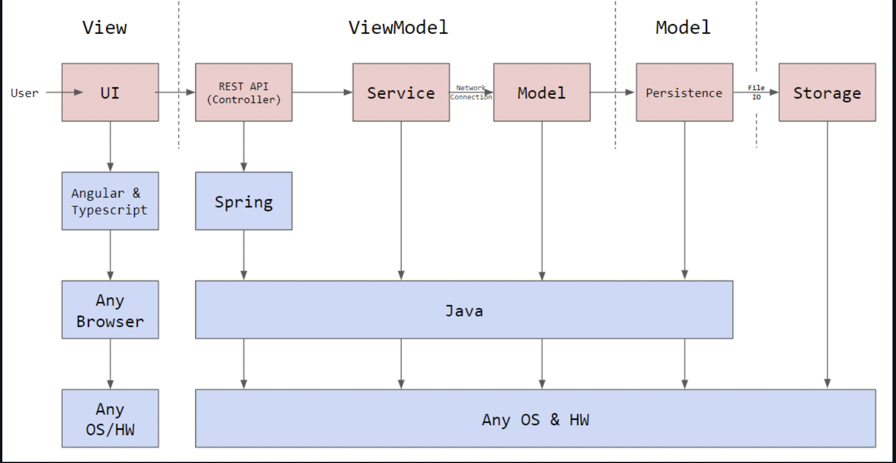
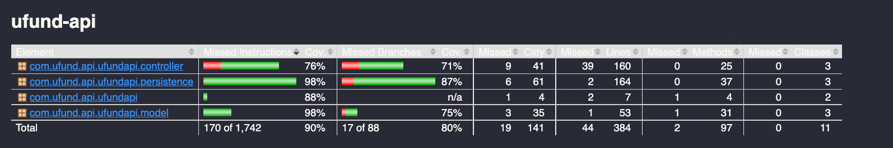
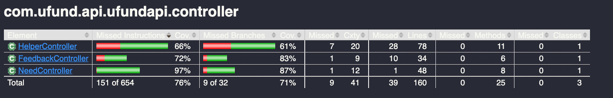
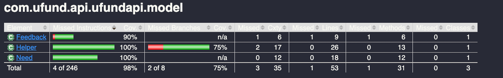
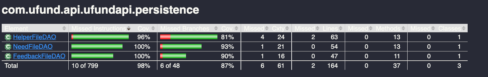

# PROJECT Design Documentation

## Team Information
* Team name: BCNS
* Team members
  * Nam Huynh
  * Saavan Tandon
  * Borneil Gope
  * Cameron Marsh

## **Executive Summary**

This is a project which creates a website for a food charity. In this website, the user is able to login as a user or an admin using a username and password. The admin is able to view the needs cupboard and add or delete needs from it. The Helper is able to view the needs in the needs cupboard that the admin has added. The Helper can also search for needs using a search bar and have access to view and modify the funding basket. Items in the funding basket persist even after the Helper logs out and logs back in. Users can also send feedback to the admin, which the admin can see after they log in. The users can "check out" needs when they have decided to contribute to them, and they can also see a history of previous needs they have contributed to that persists through log in and log outs.

### **Purpose**

The U-Fund Charity webpage will allow Helpers to donate money to causes and items in order to assist the food bank. This will
allow people with money to spare to assist those who are in need.

### **Glossary and Acronyms**

| Term    |            Definition               |
|---------|-------------------------------------|
| SPA     |  Single Page                        |
| DAO     |  Data Access Object                 |
| CSS	    |  Cascading Style Sheets             |
| TS	    |  Type Script                        |
| Angular |  Framework for web application      |
| HTML    |	 Hypertext Markup Language          |
| Admin   |	 Can edit products and orders       |
| Admin   |  User that can edit the inventory   |
| Helper  |  User that can edit their cart      |
| Need    |  A purchasable item in the cupboard |
| Cupboard|  Access to the needs                |

## **Requirements**

This section describes the features of the application.
  - Admin can add, remove, and modify needs in the needs cupboard
  - Helper can browse needs in the needs cupboard and search using keywords
  - Helper can add/delete products from their cart
  - Helper can log in to an existing account with username and password, or register should the account not exist
  - Helper can checkout their needs from the basket

### **Definition of MVP**

  - Minimal Authentication for Helper/U-fund Manager login & logout
    - A Helper can create a new account with a new username and password
    - A Helper can log into an existing account
    - The Admin already has an account in the system
    - The Admin and Helper can log out of their account
    - Data Persistence on the Helper Basket
    - Username of user is unique

  - Helper functionality
    - Helper can see list of needs
    - Helper can search for a need
    - Helper can add/remove an need to their funding basket
    - Helper can proceed to check-out and fund all needs they are supporting

  - Needs Management
    - U-fund Manager(s) can add, remove and edit the data of all their needs stored in their needs cupboard
    - A U-fund Manager cannot see contents of funding basket(s) of Helpers
    - A U-fund Manager does not have a basket

  - Data Persistence
    - The contents of the Helper basket in the basket will remain the same when the Helper log out and log back in.
    - When a Helper purchase all the need from the Cupboard, another Helper will not be able to see the needs from the Cupboard anymore until the Admin restock

### **MVP Features**

**Create New Need:** AS a Developer I WANT to submit a request to create a new need (name [unique], cost, quantity, type)
SO THAT it is added to the cupboard.

**Get a Single Need:** AS a Developer I WANT to submit a request to get a single need SO THAT I can access 
the cost, quantity and type.

**Update a Need:** AS a Developer I WANT to submit a request to update a need SO THAT I can change important information.

**Delete a Single Need:** As a Developer I want to submit a request to delete a single need SO THAT it is no longer in the cupboard.

**Get Entire Cupboard:** AS A Developer I WANT to submit a request to get the cupboard SO THAT I can update needs in the cupboard.

**Search for Needs:** AS a Developer I WANT to submit a request to get the the needs in the cupboard whose name contains the
given text, SO THAT I have access to only that subset of needs.

**Browse Needs:** AS a Helper I WANT to see a list of needs SO THAT I choose which ones to contribute to.

**Helper Authentication:** AS a Helper I WANT to login securely with my credentials SO THAT I can purchase needs from the cupboard.

**Manager Authentication:** As a Manager I WANT to login securely with my credentials SO THAT I can manage the cupboards.

**Saved Funding Basket:** AS a Helper I WANT TO be able to logout with the contents of my funding basket saved SO THAT I can manage my support efficiently without the fear of losing progress.

***Modify Cupboards (Epic):***  AS a Manager I WANT to be able to modify and populate the cupboard SO THAT I can present the best needs for the helper to fund.

  **Add Need (Manager):** AS a Manager I WANT to add a need to the Needs Cupboard SO THAT it will be available for Helpers to select.

  **Delete Need (Manager):** AS a Manager I WANT to remove a need from the Needs Cupboard SO THAT it will no longer be available 
   for Helpers to select.

***Manage Funding Basket (Epic):*** AS a Helper I WANT to be able to modify my funding basket by adding or deleting needs from 
it SO THAT I can effectively contribute to the organization.
    
**Add Needs (Helper):** AS a Helper I WANT to add needs to my funding basket SO THAT I can buy multiple needs at once.

**Delete Needs (Helper):** AS a Helper I WANT to delete needs from my funding basket SO THAT I can easily manage and refine my selection, ensuring my contributions align with my current preferences and priorities.

**View Funding Basket:** AS A Helper I WANT TO view the items in my Funding Basket SO THAT I can decide what items to fund.

**Check Out Needs:** AS a Helper I WANT to buy the needs SO THAT I can efficiently assist and address the unique challenges faced by the non-profit organization.

### **Enhancements**

**View Purchases:** AS a Helper I WANT to view a history of my past purchases so that I can track what 
needs I have contributed to and make informed decisions.
- With this feature, a Helper is able to see a list of the
items they have previously purchased by viewing a new section of the Funding Basket page.

**Send Feedback (Helper):** AS a Helper I WANT to send a feedback message to the Manager 
SO THAT I can make suggestions or notify the Manager of problems. 

**View Feedback (Manager):** AS a Manager I WANT to view a list of received 
feedback messages SO THAT I can keep informed of the Helpers' concerns and suggestions.

- For Helpers, an ability to send a feedback message is added. And the U-Fund Manager has access to a new page 
in which all feedback messages sent from the Helpers can be viewed.

## **Application Domain**v

This section describes the application domain.

## **Architecture and Design**

This section describes the application architecture.

### **Summary**

The following Tiers/Layers model shows a high-level view of the webapp's architecture. 

The web application, is built using the Model–View–ViewModel (MVVM) architecture pattern. 

The Model stores the application data objects including any functionality to provide persistance. 

The View is the client-side SPA built with Angular utilizing HTML, CSS and TypeScript. The ViewModel provides RESTful APIs to the client (View) as well as any logic required to manipulate the data objects from the Model.

Both the ViewModel and Model are built using Java and Spring Framework. Details of the components within these tiers are supplied below.

### **Overview of User Interface**

This section describes the web interface flow; this is how the user views and interacts with the web application.

> _Provide a summary of the application's user interface.  Describe, from the user's perspective, the flow of the pages in the web application._

### **View Tier**
> _**[Sprint 4]** Provide a summary of the View Tier UI of your architecture.
> Describe the types of components in the tier and describe their
> responsibilities.  This should be a narrative description, i.e. it has
> a flow or "story line" that the reader can follow._

### **Sequence Diagram**

#### **Feedback Sequence Diagram**

> _**[Sprint 4]** To adequately show your system, you will need to present the **class diagrams** where relevant in your design. Some additional tips:_
 >* _Class diagrams only apply to the **ViewModel** and **Model** Tier_
>* _A single class diagram of the entire system will not be effective. You may start with one, but will be need to break it down into smaller sections to account for requirements of each of the Tier static models below._
 >* _Correct labeling of relationships with proper notation for the relationship type, multiplicities, and navigation information will be important._
 >* _Include other details such as attributes and method signatures that you think are needed to support the level of detail in your discussion._

### **ViewModel Tier**
- **NeedController:** Responds to HTML requests for the Needs resource. It connects the Need UI to the Need model
in the backend and will create, update, and get needs from the needs cupboard as necessary, all by accessing
methods in NeedDAO objects.

- **HelperController:** Responds to HTML requests for the Helper resource. It connects the Funding Basket and Helper
related UI to the backend, with functionality to create, get and authenticate helpers as well as manipulate
a Helper's Funding Basket, all by accessing methods in HelperDAO objects.

- **FeedbackController:** Responds to HTML requests for the Feedback resource. It connects the Feedback UI to the Feedback model
in the backend, with functionality for helpers to send feedback and managers to view feedback as necessary, all by acessing
methods in FeedbackDAO objects.

- **NeedDAO:** An interface for the Data Access Object used to access and modify the underlying storage
for the Needs Cupboard.

- **NeedFileDAO:** The specific implementation of NeedDAO. Contains functionality to create and get a need from
the underlying storage, as well as search, update, and delete.

- **HelperDAO:** An interface for the Data Access Object used to access and modify the underlying storage for
Helpers and their funding baskets.

- **HelperFileDAO:** the specific implementation of HelperDAO. Access the underlying storage to create, 
get, and update Helpers as well as their Funding Baskets. Also authenticates their login credentials.

- **FeedbackDAO:** An interface for the Data Access Object used to access and modify the underlying storage
allocated for the feedback.

- **FeedbackFileDAO:** The specific implementation of FeedbackDAO. Contains functionality for helpers to send feedback
and managers to view feedback as necessary.

> _**[Sprint 4]** Provide a summary of this tier of your architecture. This
> section will follow the same instructions that are given for the View
> Tier above._

> _At appropriate places as part of this narrative provide **one** or more updated and **properly labeled**
> static models (UML class diagrams) with some details such as critical attributes and methods._
> 

### **Model Tier**
- **Need:** Acts as a Java representation of a single need and its attributes. Works in tandem
with NeedFileDAO and NeedController such that needs are loaded from the underlying 
storage into Need instances.

- **Helper:** Acts as a Java representation for a single Helper, its data, and its Funding Basket.
Works in tandem with HelperController and HelperFileDAO to load Helpers and their funding
baskets from the underlying storage into Helper instances.

- **Feedback:** Acts as a Java representation of a single feedback message and its attributes. Works in tandem
with FeedbackFileDAO and FeedbackController such that feedback messages are loaded from the underlying 
storage into Feedback instances.

> _**[Sprint 2, 3 & 4]** Provide a summary of this tier of your architecture. This
> section will follow the same instructions that are given for the View
> Tier above._

> _At appropriate places as part of this narrative provide **one** or more updated and **properly labeled**
> static models (UML class diagrams) with some details such as critical attributes and methods._
> 

## OO Design Principles

**Single Responsibility:** The project was guided by our domain model diagram which allowed us
to create classes separating each major aspect of the project's functionality. For example,
we have feedback classes like FeedbackController to handle the HTTP requests and connecting to the JSON instead of
integrating that functionality into the already-existing Helper (as it is only meant to act as a java representation of the Helper's fields). 

**Open/Closed:** Our Data Access Object classes are extensions of interfaces, including
FeedbackDAO, HelperDAO and NeedDAO. This allowed us to add functionality to the Data Access
Objects while not modifying their base functionality and ensuring the most important
parts always work the same.

**Low Coupling:** Unnecessary interdependence between classes is reduced by encapsulating the necessary data
for each each method within the same class, or connecting it to abstractions where possible. For example the Helper class contains the shopping cart which allows shopping cart operations to be handled without depending on another class. The separation of DAOs from Controllers via interfaces also prevents a direct dependency on one another. Below, the attributes of a Helper instance are shown.
 

**Pure Fabrication:** The project makes use of several functionality-focused classes
that aid the representation-focused classes. For example, HelperController, which handles
actual Helper instances, creates a HelperDAO instance to manage the access to the storage.
In addition, many vital components of the UI have functionality-focused Services developed
to accompany them, such as the user.service and feedback.service files. The hierarchy is shown below in this screen grab from the UML model:

## Static Code Analysis/Future Design Improvements
> _**[Sprint 4]** With the results from the Static Code Analysis exercise, 
> **Identify 3-4** areas within your code that have been flagged by the Static Code 
> Analysis Tool (SonarQube) and provide your analysis and recommendations.  
> Include any relevant screenshot(s) with each area._

### **Static Code Analysis Overall Score**

- **Analysis**: Overall, both the UI and API components are well implemented and tested.

#### **Static Code Analysis Issue 1**

- **Analysis**: A shorthand property defined after a longhand property will completely override the value defined in the longhand property making the longhand one useless. The code should be refactored to consider the longhand property or to remove it completely.
- **Recommendations**: Move the 'background' field on top of the 'background-color' field.

#### **Static Code Analysis Issue 2**

- **Analysis**: Correctly updating a static field from a non-static method is tricky to get right and could easily lead to bugs if there are multiple class instances and/or multiple threads in play. Ideally, static fields are only updated from synchronized static methods.
- **Recommendations**: 
  
#### **Static Code Analysis Issue 3**

- **Analysis**: Unexpected duplicate of color could led to the previously defined 'color' field to get override.
- **Recommendations**: Remove the duplicate 'color' field.

> _**[Sprint 4]** Discuss **future** refactoring and other design improvements your team would explore if the team had additional time._

## **Testing**

### **Acceptance Testing**
- **29** user stories in total, covering:
  - Admins being able to edit needs from the cupboard
  - Helpers being able to login/creating their account
  - Helpers being able to edit needs from their basket
  - Helpers being able to checkout their basket
  - Helpers being able to search for needs
  - Persistence of the shopping carts
  - 10% Features: creating/viewing feedbacks and display purchase history

**All user stories have passed their acceptance criteria tests.**

### **Unit Testing and Code Coverage**

**Strategy**
We targeted 90% code coverage across the project with our unit tests because 
this would ensure minimal gaps in the coverage while still being achievable.

**U-fund API Class Level Code Coverage:**

**U-fund API Controller Code Coverage:**

  - **Controller**: The controller tier has 76% code coverage overall, primarily due to the large size of 
  HelperController making it difficult to test.

**U-fund API Model Code Coverage:**

  - **Model**: The model tier has 100% code coverage overall, meaning it is very well tested. All tests created for this tier passed.

**U-fund API Persistence Code Coverage:**

  - **Persistence**: The persistence unit test is well done.
 
## **Ongoing Rationale**
  - (2024/2/10): Sprint 1
    - The 10% feature will be Helper Feedback and Purchase History Page
  - (2024/3/19): Sprint 2
    - The team will change the architecture of the project significantly by removing the Basket logic in the API entirely and will be represented as an array of Needs in the Helper
    - Rationale:
      - Reduce the number of unnecessary unit testing
      - Making the Basket as an attribute of Helper would make a significantly improvement on the design and better adherence to GRASP Principles by reducing Coupling Issue
  - (2024/4/3): Sprint 3
    - The team will change the architecture of the project by adding the a list of purchase history to the Helper
    - Rationale:
      - Reduce the number of unnecessary unit testing
      - Making it easier to implement and keep track of the purchase history